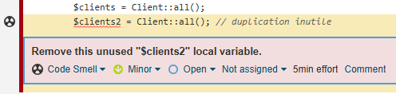
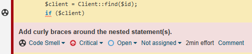

# Projet : Test d'outils d'intégration continue (Jenkins + SonarQube)

Ce projet a pour objectif de mettre en place un environnement d'intégration continue avec Jenkins et SonarQube, puis d'ajouter volontairement quelques bugs pour observer comment les outils détectent les problèmes.

# Déroulé de la découverte des outils de test

1. Initialisation du projet et création de la base Laravel.
    
    Nous avons d'abord créé un projet Laravel vierge, et y avons ajouté une base de code back + database + front simple pour un CRUD de clients.
        
2. Première utilisation de SonarQube 

    Test et premier aperçu de SonarQube. Navigation dans les interfaces et découverte des types de bugs détectés.

3. Installation des images Docker (SonarQube et Jenkins)

    Par le biais d'un DockerFile, docker-compose et JenkinsFile, nous avons simplifié le lancement de ces différents outils au sein de l'application.

4. Configuration des outils

    Jenkins nécessite pas mal de temps à la configuration. 
    - Ajout de tous les plugins
    - Liaison avec SonarQube
        - Utilisation de Credentials pour le token
        - Gérer les URLs
    - Liaison avec le repository Github
        - [A FAIRE] Utilisation de Github webhook
    - Création et configuration du JenkinsFile
    - [A FAIRE] Ajout des vérifications OWASP 

5. Ajout volontaire de bugs

    Les outils étant mis en place et configurés, il faut maintenant insérer volontairement des bugs et constater la détection de SonarQube.

6. Reporting

# Installation et utilisation des outils

## Prérequis

- Docker et Docker Compose installés
- S'assurer que le port **9000** est libre (utilisé par SonarQube)

## Lancement de l'environnement

1. Lancer Docker (exemple : Docker Desktop)

2. Vérifiez que le port 9000 est libre :
   ```bash
   docker ps
   ```
Si un conteneur utilise déjà le port, pensez à l'arrêter avant de continuer.

3. Placez vous dans le bon dossier :
    ```bash
    cd jenkins-docker-sonar
    ```
    Et lancer les conteneurs Jenkins et sonarQube
    ```bash
    docker compose up -d
    ```

4. Accédez aux interfaces :

    Jenkins : http://localhost:8080

    SonarQube : http://localhost:9000

## Utilisation
Sur Jenkins, vous pouvez consulter les tests déjà passés.

Vous pouvez également lancer manuellement de nouveaux tests pour vérifier la détection des bugs introduits.

# Défauts de code intégrés pour démonstration SonarQube

Ce projet contient volontairement plusieurs défauts de code pour illustrer les capacités de détection de SonarQube. Voici la liste des défauts intégrés, leur description et leur emplacement :

1. **Duplication de code**
   - *Description :* Bloc de code identique répété inutilement.
   - *Emplacement :* `ClientController.php`, méthode `index()`

   Source de l'erreur :

      ```php
      $clients = Client::all();
      $clients2 = Client::all(); // duplication inutile
      ```
   Détection :

    

    Correction de l'erreur :

      ```php
      $clients = Client::all();
      ```

2. **If/then mal formé**
   - *Description :* Utilisation d'un if sans accolades.
   - *Emplacement :* `ClientController.php`, méthode `show()`

   Source de l'erreur :

    ```php
    if ($client) // if sans accolades
        return view('client.show', ['client' => $client]); 
    ```

    Détection :

    

    Correction de l'erreur :

    ```php
    if ($clients) {
        return view('client.show', ['client' => $client]);
    }
    ```

3. **Mauvais nommage de variable/fonction/classe**
   - *Description :* Nom de fonction non conforme (`SaveClient` au lieu de `saveClient`).
   - *Emplacement :* `ClientController.php`, méthode `SaveClient()`

6. **Code mort (fonction jamais appelée)**
   - *Description :* Fonction définie mais jamais utilisée.
   - *Emplacement :* `ClientController.php`, méthode `inutile()`

7. **Utilisation de == au lieu de ===**
   - *Description :* Utilisation de l'opérateur == au lieu de === pour la comparaison.
   - *Emplacement :* `ClientController.php`, méthode `search()`

8. **Variable non initialisée**
   - *Description :* Utilisation d'une variable sans initialisation préalable.
   - *Emplacement :* `ClientController.php`, méthode `SaveClient()`

9. **Manque de commentaires/documentation**
   - *Description :* Absence de commentaires ou de documentation sur les méthodes.
   - *Emplacement :* `ClientController.php` (plusieurs méthodes)

10. **SQL non préparé (risque d’injection)**
    - *Description :* Requête SQL construite dynamiquement sans préparation.
    - *Emplacement :* `ClientController.php`, méthode `rawSearch()`

12. **Mauvaise gestion des exceptions**
    - *Description :* Exception capturée mais ignorée sans traitement ni log.
    - *Emplacement :* `ClientController.php`, méthode `delete()`

13. **Accès direct à $_POST/$_GET sans validation**
    - *Description :* Utilisation directe de la superglobale `$_POST` sans validation.
    - *Emplacement :* `ClientController.php`, méthode `unsafeStore()`

14. **Non-respect des conventions PSR (indentation, espaces, etc.)**
    - *Description :* Indentation et espaces non conformes aux standards.
    - *Emplacement :* `Client.php` (modèle) et `resources/views/client/show.blade.php` (vue)

Chaque défaut a été intégré pour être détectable par SonarQube lors de l'analyse du projet.